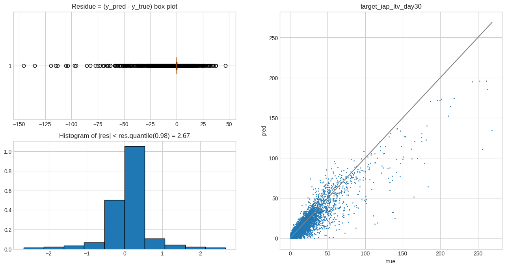

# IASA DS Champ Test Task
Розв'язок задачі для відбіркового завдання хакатону IASA DS Champ від команди Team GARCH

# Summary
- [EDA](./notebooks/exploration.ipynb) - дослідження датасету, та змін розподілів з часом
- [Model training](./notebooks/training.ipynb) - Multioutput LightGBM на кожен з таргетів, кросс-валідація по часу
- Model inferencing

# Report
## Аналіз задачі та даних
> Детальніше - [Блокнот з EDA](./notebooks/exploration.ipynb)

Маємо дані розподілені в часі (install_date), в цьому випадку доцільно валідувати моделі використовуючи перехресне розбиття за часом,
Навіть попри те, що в контексті цього завдання ми розглядаємо кожного користувача окремо, розподіли фіч та таргетів можуть змінюватись з часом через зовнішні обставини (Data Drift). Тому коректний вибір валідаційної схеми є важливим задля запобігання випадку коли ми валідуємо "прогнозуючи минуле по майбутньому", що є нонсенсом в контексті бізнес задачі, і фактично є оверфітом під вже зібраний датасет.

Наданий датасет покриває період грудень 2021 - січень 2022. Після дослідження бачимо, що розподіл кількості встановлень за день нерівномірний,
отже для кросс-валідації надамо перевагу розбиттю на рівномірні інтервали за датою встановлення.
Як довжину інтервалу було обрано значення в 7 днів.

## Метрика
- Оскільки ми прогнозуємо ltv, тобто грошову величину, в якості "основної" метрики доцільно обрати **MAE**, оскільки вона має ту ж одиницю виміру, що і оригінальна величина, та легка для розуміння, що дуже важливо коли мова йде про фінанси - це дає змогу одразу зрозуміти на яку суму модель пере-/недооцінила реальний прибуток, а також знаючи порядок точності моделі, закласти відповідні ризики.
- Додатковою метрикою слугує RMSE, оскільки внаслідок квадратичності, сильно зростає у випадку, якщо модель пере-/недооцінює ltv "китів", що теж є важливим.
- MAPE в цьому випадку є поганим вибором, оскільки набуває неінформативно великих значень через велику кількість користувачів з нульовим чи низьким ltv, а також є не дуже корисною з точки зору бізнес-логіки - помилка в 10 доларів, це вже ще помилка в 10 доларів, не залежно від того, скільки користувач приніс загалом.
- Також, в для більш загального розуміння якості прогнозу, ми вказуємо точність класифікації "нульових" користувачів, і окремо усі регресійні метрики на "ненульових"

## Модель
> Training & analysis - [Notebook](./notebooks/training.ipynb) \
> Inference - Coming soon

Фінальною цільовою змінною є сума трьох ltv різної природи, прогнозуватимемо кожне з них окремо, а потім сумуватимемо,
оскільки кожен таргет може залежати від різних ознак.

Як основну модель оберемо градієнтний бустинг з [LightGBM](https://lightgbm.readthedocs.io/en/v3.3.2/), оскільки ця категорія алгоритмів демонструє SOTA точність для більшості задач прогнозування на табличних даних, а також гарно узагальнює за рахунок ансамблюваня weak learner'ів (неглибоких дерев прийняття рішень) та внутрішніх механізмів регуляризації.
З особливостей - визначимо цільову функцію оптимізації як "[tweedie](https://medium.com/@royravid/have-you-heard-about-tweedie-loss-bb94551dd82f)", оскільки вона, на відміну від стандартної "mse", схильна демонструвати кращий результат у випадку,
коли розподіл цільової змінної має багато нулів та довгий хвіст.

### Feature Enginnering
Було створено певну кількість ознак, що повинні допомогти моделям на основі дерев знаходити залежності.

В їх числі:
- datetime фічі витягнуті з install_date, sin/cos представлення, день-місяць-рік, а також спеціальний флаг на свята та вихідні
- дельти. Для користувача дані значення різних показників за 1, 2, 3 ... день, але моделі важливі не абсолютні значення, а динаміку між ними, проте дерева через свою внутрішню структуру не можуть отримати такі різниці самостійно. Введемо різниці між послідовними значеннями як додаткові ознаки
- прогноз лінійної регресії. Для кожного з таргетів, побудуємо лінійну модель на значеннях цього ltv за 1, 2, 3 день (time-respecting, використовуючи те ж часове розбиття для тренування/прогнозування що й в основній моделі), та введемо значення її предикту, як ще одну ознаку. Це повинно допомогти моделі врахувати загальний тренд ltv користувачів.
- users_joined_this_day - сумарна кількість встановлень в день встановлення цього користувача

### Результати

Найкраща модель продемонструвала наступні значеня метрик на кожному з фолдів:

|  | min        | max        |   rmse_full |   rmse_sub |   rmse_iap |   rmse_add |   **mae_full** |    mae_sub |   mae_iap |    mae_add |
|--------------:|:-----------|:-----------|------------:|-----------:|-----------:|-----------:|-----------:|-----------:|----------:|-----------:|
|             0 | 2021-12-15 | 2021-12-21 |    1.05046  |   0.243868 |   0.967072 |  0.096256  |  0.0716846 | 0.0158857  | 0.0548655 | 0.00595447 |
|             1 | 2021-12-22 | 2021-12-28 |    0.991256 |   0.179055 |   0.930357 |  0.0672381 |  0.043206  | 0.00919226 | 0.0332488 | 0.0038613  |
|             2 | 2021-12-29 | 2022-01-04 |    0.743809 |   0.19682  |   0.69054  |  0.0551449 |  0.0447429 | 0.0115289  | 0.0340868 | 0.00359751 |
|             3 | 2022-01-05 | 2022-01-11 |    1.14171  |   0.284633 |   1.03197  |  0.127711  |  0.0921513 | 0.0234341  | 0.0688752 | 0.00838422 |
|             4 | 2022-01-12 | 2022-01-18 |    1.19973  |   0.252006 |   1.10811  |  0.142926  |  0.100108  | 0.0234177  | 0.0759227 | 0.0110022  |
|             5 | 2022-01-19 | 2022-01-25 |    1.38448  |   0.254395 |   1.3143   |  0.117198  |  0.101235  | 0.0234095  | 0.0760869 | 0.0112832  |
|             6 | 2022-01-26 | 2022-01-31 |    1.07576  |   0.248244 |   1.01854  |  0.0739662 |  0.0929703 | 0.0221284  | 0.0718179 | 0.00864464 |

В тому числі:
fold-mean mae_full score: 0.07801, fold-std mae_full score: 0.02333

Що є, на нашу думку, доволі гарним результатом.

### Feature importance
> [Повне зображення](./notebooks/resources/importances.png)

З фіча імпортанса моделі (сумарна кількість розбиттів в деревах по кожній з фіч) робимо висновок, що найважливішими фічами є ті, що описують залученість юзера в ігровий процес та авторегресійна складова - значення цього ж таргета за перші дні. Зокрема в топі:
- **sub** - users_joined_this_day, diamonds_received, diamonds_spent
- **iap** - diamonds_spend, diamonds_received, users_joined_this_day
- **ad** - users_joined_this_day, ad_ltv

Також, на подив, доволі непогано себе показала фіча users_joined_this_day - ймовірно, вона допомогає моделі детектити певні напливи аудиторій, пов'язані з рекламними кампаніями, тощо. Такого роду агрегати значень попередніх періодів можуть мати непоганий потенціал, сюди можна включати не лише кількість завантажень, а й сумарне та середнє ltv, проте наданий датасет охоплює занадто короткий проміжок часу, щоб такими значеннями спокійно оперувати.

### Аналіз помилок
> візуалізація residuals решти таргетів - в [training notebook](./notebooks/training.ipynb)

З наведених графіків видно, що типова помилка моделі це **underestimate** реального ltv, що в принципі є більш бажаним характером помилки для бізнесу.
З іншими таргетами ситуація аналогічна.

З можливих причин такої поведінки - наявність великої кількості zero-ltv користувачів, що надійшли [напередодні нового року](./notebooks/exploration.ipynb), що може бути пов'язано з:
- сезонністю, яку модель не може захопити, оскільки має в розпорядженні лише історичні записи за два місяці
- певна зовнішня подія, рекламна кампанія, випуск оновлення, тощо, про яку інформацію не надано